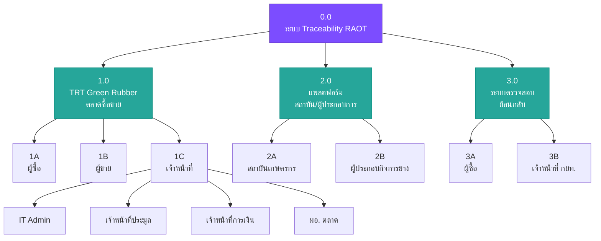
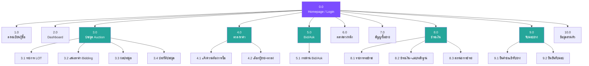
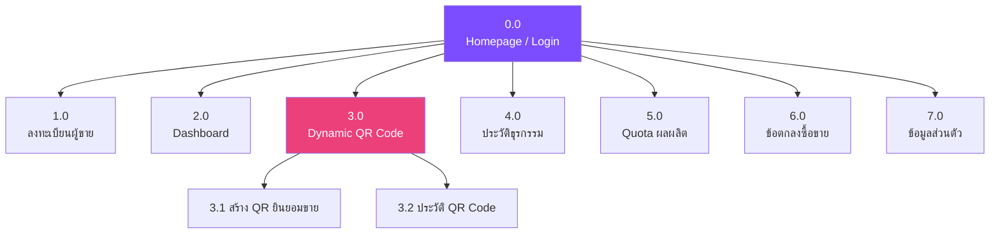
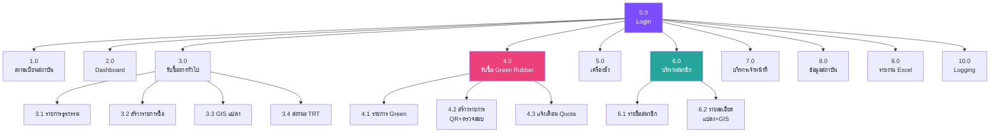
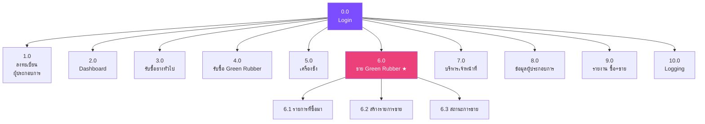
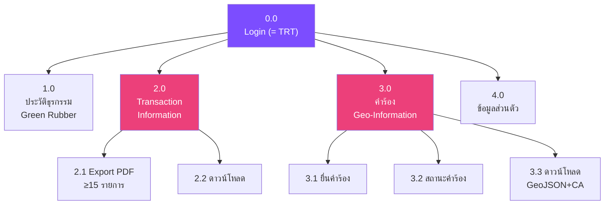

# Sitemap — ระบบตรวจสอบย้อนกลับผลผลิตยางพารา (RAOT Traceability)

**เวอร์ชัน:** 0.1
**วันที่:** 30 มีนาคม 2569
**อ้างอิง:** system-workflow-v3.3, TOR เอกสารแนบ ๒, TRT_Customer/Market/Officer/Mobile

---

## ภาพรวมระบบ



---

# 1. TRT Green Rubber (ระบบตลาดซื้อขาย Green Rubber)

> อ้างอิง: TOR ข้อ 2.3, 2.4, 2.11 / system-workflow ส่วนที่ 3

---

## 1A. ผู้ซื้อ (Buyer)

> อ้างอิง: TRT_Customer.pdf (ส่วนผู้ซื้อ), system-workflow 3.1



```
ผู้ซื้อ
├── 🔐 เข้าสู่ระบบ (Login)
├── 📝 ลงทะเบียน (Registration)
│   ├── ยอมรับ PDPA
│   ├── ขั้นตอนที่ 1: ข้อมูลส่วนตัว
│   ├── ขั้นตอนที่ 2: ข้อมูลบัญชีธนาคาร
│   ├── ขั้นตอนที่ 3: ตั้งรหัสผ่าน
│   └── ขั้นตอนที่ 4: อัปโหลดเอกสาร
├── 🏠 หน้าหลัก / Dashboard
│   ├── สรุปธุรกรรม
│   ├── สถานะสัญญา
│   └── แจ้งเตือน
├── 📋 ประมูล (Auction)
│   ├── รายการ LOT ที่เปิดประมูล
│   ├── หน้าเสนอราคา (Bidding)
│   │   ├── เสนอราคา (Weight Round + Price Round)
│   │   ├── Countdown Timer
│   │   └── ผลการประมูล (ชนะ/แพ้)
│   └── ประวัติการประมูล
├── 🤝 ตกลงราคา (Negotiated Price)
│   ├── แจ้งความต้องการซื้อ
│   ├── ดูรายการผู้ขายที่เสนอ
│   ├── เลือกผู้ขาย + ตกลงเงื่อนไข
│   └── ประวัติการตกลงราคา
├── 📊 เสนอซื้อเสนอขาย (Bid/Ask)
│   ├── กระดานเสนอซื้อ/เสนอขาย
│   ├── สร้างข้อเสนอ
│   ├── ตอบรับ/ปฏิเสธ/เสนอกลับ
│   └── ประวัติข้อเสนอ
├── 📅 ตลาดล่วงหน้า (Forward Contract)
│   ├── ดูรายการที่เปิด
│   ├── เสนอเงื่อนไข (น้ำหนัก + ราคา)
│   └── ประวัติตลาดล่วงหน้า
├── 📄 สัญญาซื้อขาย (Contracts)
│   ├── รายการสัญญา (กรองสถานะ)
│   └── รายละเอียดสัญญา (PDF)
├── 💰 ชำระเงิน (Payment)
│   ├── รายการรอชำระ
│   ├── ชำระเงิน (เลือกธนาคาร + แนบหลักฐาน)
│   ├── สถานะการชำระ (รอตรวจสอบ/อนุมัติ/ปฏิเสธ)
│   └── ประวัติการชำระ
├── 🚚 รับมอบยาง (Delivery)
│   ├── รายการรอรับมอบ
│   ├── ยื่นคำขอเข้ารับยาง
│   │   ├── ระบุวันนัดหมาย
│   │   ├── ข้อมูลผู้รับ (ชื่อ, ทะเบียนรถ, จังหวัด, ประเภท/ยี่ห้อ/รุ่น)
│   │   └── น้ำหนักที่รับ
│   ├── ยืนยันรับมอบ (PIN 6 หลัก)
│   └── ประวัติการรับมอบ
├── 👤 ข้อมูลส่วนตัว (Profile)
│   ├── แก้ไขข้อมูลส่วนตัว
│   ├── จัดการบัญชีธนาคาร
│   ├── จัดการตลาดที่ลงทะเบียน (เพิ่มตลาด)
│   ├── เปลี่ยนรหัสผ่าน
│   └── ปิดบัญชี
└── 📢 แจ้งเตือน (Notifications)
    ├── ผลประมูล
    ├── แจ้งชำระเงิน
    ├── แจ้งส่งมอบ
    └── สถานะเอกสาร
```

---

## 1B. ผู้ขาย (Seller)

> อ้างอิง: TRT_Customer.pdf (ส่วนผู้ขาย), system-workflow 3.2



```
ผู้ขาย
├── 🔐 เข้าสู่ระบบ (Login)
├── 📝 ลงทะเบียน (Registration)
│   ├── ยอมรับ PDPA
│   ├── เลือกชนิดยาง (≥1 ชนิด)
│   ├── เลือกตลาด (1 ตลาดเท่านั้น)
│   ├── เลือกประเภทผู้ขาย (5 ประเภท)
│   ├── ขั้นตอนที่ 1-4 (เหมือนผู้ซื้อ)
│   └── ข้อมูลแปลง (กรณีเกษตรกร)
├── 🏠 หน้าหลัก / Dashboard
│   ├── Remaining Quota (ปริมาณคงเหลือ)
│   ├── สถานะธุรกรรม
│   └── แจ้งเตือน
├── 📱 Dynamic QR Code
│   ├── สร้าง QR Code ยินยอมการขาย
│   │   ├── ระบุแปลง + ชนิดยาง
│   │   ├── แสดง QR (มีอายุตาม กยท. กำหนด)
│   │   └── มอบอำนาจให้ผู้อื่นขายแทน
│   └── ประวัติ QR Code
├── 📋 ประวัติธุรกรรม (Transaction History)
│   ├── รายการธุรกรรม (กรองวันที่/ชนิดยาง/ตลาด)
│   └── รายละเอียดธุรกรรม
├── 📊 ปริมาณผลผลิตคาดการณ์ (Quota)
│   ├── Quota รวมต่อแปลง
│   ├── Remaining Quota
│   └── ประวัติการใช้ Quota
├── 📄 ข้อตกลงซื้อขาย (Trade Agreement)
│   ├── รายการข้อตกลง (ต่อตลาด/ต่อชนิดยาง)
│   └── ยอมรับข้อตกลง
├── 👤 ข้อมูลส่วนตัว (Profile)
│   ├── แก้ไขข้อมูลส่วนตัว
│   ├── จัดการบัญชีธนาคาร
│   ├── เปลี่ยนรหัสผ่าน
│   └── ปิดบัญชี
└── 📢 แจ้งเตือน (Notifications)
    ├── ผลการคัดคุณภาพ
    ├── ผลการชำระเงิน
    ├── สถานะเอกสาร
    └── แจ้งเตือนผู้ขาย
```

---

## 1C. เจ้าหน้าที่ (Officer)

> อ้างอิง: TRT_Market.pdf, TRT_Officer.pdf, system-workflow 3.3

```mermaid
graph TD
    O0["0.0<br/>Login เจ้าหน้าที่"]
    O0 --> O1["1.0<br/>ลงทะเบียนยาง"]
    O0 --> O2["2.0<br/>จุดชั่ง/คัดคุณภาพ"]
    O0 --> O3["3.0<br/>จัดการแผง"]
    O0 --> O4["4.0<br/>ประมูล Auction"]
    O0 --> O5["5.0<br/>ตกลงราคา"]
    O0 --> O6["6.0<br/>Bid/Ask"]
    O0 --> O7["7.0<br/>ตลาดล่วงหน้า"]
    O0 --> O8["8.0<br/>สัญญาซื้อขาย"]
    O0 --> O9["9.0<br/>อนุมัติผู้ซื้อ/ผู้ขาย"]
    O0 --> O10["10.0<br/>ส่งมอบยาง"]
    O0 --> O11["11.0<br/>ชำระเงิน"]
    O0 --> O12["12.0<br/>ตั้งค่าตลาด<br/>IT Admin"]
    O0 --> O13["13.0<br/>จัดการเจ้าหน้าที่"]
    O0 --> O14["14.0<br/>รายงาน"]

    O1 --> O11a["1.1 สแกน QR+ตรวจสอบ"]
    O1 --> O12a["1.2 สร้าง LOT"]
    O1 --> O13a["1.3 นำเข้า Excel"]

    O2 --> O21["2.1 ชั่งน้ำหนัก"]
    O2 --> O22["2.2 คัดคุณภาพ Grade"]
    O2 --> O23["2.3 น้ำหนักรถออก"]

    O4 --> O41["4.1 เปิด/ปิดรอบ"]
    O4 --> O42["4.2 ประกาศผู้ชนะ"]
    O4 --> O43["4.3 Proxy Bidding"]
    O4 --> O44["4.4 เลื่อน/ยกเลิก"]

    O9 --> O91["9.1 ตรวจสอบเอกสาร"]
    O9 --> O92["9.2 ต่ออายุสิทธิ์"]
    O9 --> O93["9.3 จัดการสิทธิ์"]

    O10 --> O101["10.1 ตลาดกลาง"]
    O10 --> O102["10.2 ตลาดเครือข่าย"]
    O10 --> O103["10.3 แยก EUDR/Non Green"]

    O11 --> O111["11.1 ชำระแทนผู้ซื้อ"]
    O11 --> O112["11.2 ตรวจสอบหลักฐาน"]
    O11 --> O113["11.3 จ่ายเงินผู้ขาย"]

    O12 --> O121["12.1 เวลาเปิด-ปิด"]
    O12 --> O122["12.2 รอบประมูล"]
    O12 --> O123["12.3 ค่าธรรมเนียม"]
    O12 --> O124["12.4 Tolerance"]
    O12 --> O125["12.5 ราคาเปิดตลาด"]

    style O0 fill:#7c4dff,color:#fff
    style O4 fill:#26a69a,color:#fff
    style O10 fill:#26a69a,color:#fff
    style O11 fill:#26a69a,color:#fff
    style O12 fill:#26a69a,color:#fff
```



### 1C-1. IT Admin (ผู้ดูแลระบบสารสนเทศประจำตลาด)

```
IT Admin
├── 🔐 เข้าสู่ระบบ
├── 👥 จัดการเจ้าหน้าที่
│   ├── เพิ่ม/แก้ไข/ระงับ เจ้าหน้าที่
│   └── กำหนดสิทธิ์ (เมนู checkbox)
├── 💰 ตั้งค่าราคาอ้างอิง (ส่วนกลาง)
├── 📊 ตั้งค่าราคาเปิดตลาด
│   ├── ราคาเปิดต่อชนิดยาง/ต่อรอบ
│   └── อนุมัติราคาเปิด (2 ระดับ)
├── ⏰ ตั้งค่าเวลาเปิด-ปิดตลาด
│   ├── เปิด/ปิดรายวัน (จ-อา)
│   └── เวลาเปิด-ปิดต่อวัน
├── 🔄 ตั้งค่ารอบประมูล
│   ├── จำนวนรอบ (สูงสุด 7 RSS / 6 USS)
│   ├── ช่วงเวลาต่อรอบ
│   └── ชนิดยางต่อรอบ
├── 💳 ตั้งค่าการชำระเงิน
│   ├── สัดส่วนชำระ (100% / 80%+20%)
│   ├── ค่าธรรมเนียม
│   └── เงื่อนไขการประมูล
├── ⚖️ ตั้งค่าเครื่องชั่ง
│   └── ค่า Tolerance
├── 🏪 จัดการข้อมูลตลาด
│   ├── ข้อมูลตลาดกลาง/เครือข่าย
│   └── จัดการน้ำหนักรถ
└── 📊 รายงาน
```

### 1C-2. เจ้าหน้าที่ประมูล / เจ้าหน้าที่ตลาด

```
เจ้าหน้าที่ประมูล
├── 🔐 เข้าสู่ระบบ
├── 📝 ลงทะเบียนยางเข้าตลาด
│   ├── สแกน QR Code ผู้ขาย (ตรวจสอบ: เอกสารสิทธิ์, บุกรุกป่า, Remaining Quota)
│   ├── เลือกชนิดยาง + ประมาณน้ำหนัก
│   ├── สร้าง LOT (แยก EUDR / Non Green)
│   ├── เพิ่มรายการผู้ขาย (หลายรายต่อ LOT)
│   └── ลงทะเบียนจากสถาบัน (นำเข้า Excel)
├── ⚖️ จุดชั่ง / คัดคุณภาพ
│   ├── คิวตามชนิดยาง
│   ├── ชั่งน้ำหนัก (เชื่อมเครื่องชั่ง / กรอกมือ)
│   ├── คัดคุณภาพ (Board Code + Grade)
│   └── น้ำหนักรถออก (ตรวจผลต่าง %)
├── 🏷️ จัดการแผง (Board/Panel)
│   ├── เพิ่ม/แก้ไข แผง (รหัส, น้ำหนักทาร์, สถานะ)
│   ├── ดูประวัติการใช้แผง
│   └── Export ข้อมูลแผง
├── 📋 ประมูล (Auction)
│   ├── เปิดรอบประมูล
│   ├── แสดง LOT ที่เข้าประมูล (Auto ตามกำหนดเวลา)
│   ├── ลงทะเบียน + เสนอราคาพร้อมกัน (Concurrent)
│   ├── ปิดรอบน้ำหนัก
│   ├── ปิดรอบราคา
│   ├── ประกาศผู้ชนะ
│   ├── เสนอราคาแทนผู้ซื้อ (Proxy Bidding)
│   ├── เลื่อนรอบประมูล
│   └── ยกเลิกรอบประมูล
├── 🤝 ตกลงราคา (Negotiated Price)
│   ├── รับความต้องการจากผู้ซื้อ
│   ├── ประกาศให้ผู้ขาย
│   ├── รวบรวมข้อเสนอ
│   └── จับคู่ผู้ซื้อ-ผู้ขาย
├── 📊 เสนอซื้อเสนอขาย (Bid/Ask)
│   ├── แสดงกระดาน Bid/Ask
│   └── จัดการข้อเสนอ
├── 📅 ตลาดล่วงหน้า (Forward Contract)
│   ├── เปิดประมูลฝั่งผู้ซื้อ
│   ├── ตั้งรายการรับล่วงหน้า
│   ├── จัดการผู้ขายเสนอปริมาณ
│   └── ออกสัญญาต่อผู้ขาย
├── 📄 สร้างสัญญาซื้อขาย
│   ├── สัญญาตามประเภทยาง (ชั้น 1: การเงินสร้าง / ชั้น 2: ประมูลสร้าง)
│   ├── ดูรายการสัญญา
│   └── พิมพ์สัญญา (PDF)
├── 👥 อนุมัติผู้ซื้อ/ผู้ขาย
│   ├── ตรวจสอบเอกสารลงทะเบียน
│   ├── อนุมัติ/ปฏิเสธ (ระบุเหตุผล)
│   ├── ต่ออายุสิทธิ์ผู้ซื้อ (รายปี)
│   └── จัดการสิทธิ์เข้าถึง (เปิด/ปิด + เมนู checkbox)
├── 🚚 ส่งมอบยาง
│   ├── ตลาดกลาง
│   │   ├── แสดงรายการคำขอเข้ารับ
│   │   ├── กดส่งมอบ (น้ำหนักรถ)
│   │   ├── ชั่งแผง (Board Code + น้ำหนัก)
│   │   ├── ออกเอกสารส่งมอบ
│   │   └── ลงนามทั้งสองฝ่าย
│   ├── ตลาดเครือข่าย
│   │   ├── บันทึกน้ำหนัก ณ จุดลงทะเบียน
│   │   ├── เลือกรูปแบบส่งมอบ (3 แบบ)
│   │   ├── ออกเอกสารส่งมอบ
│   │   └── ลงนามทั้งสองฝ่าย
│   └── แยก EUDR / Non Green ณ จุดส่งมอบ
│       ├── ยางก้อนถ้วย: แยกภาชนะ + ป้าย
│       ├── ยางแผ่นดิบ: แยกบ่อแช่ + ราว
│       ├── ยางแผ่นรมควัน: แยกห้องรมควัน
│       ├── น้ำยางสด: แยกถังเก็บ + ป้าย
│       └── ยางเครป: แยกสายการผลิต + ป้าย
├── 🔗 เชื่อมต่อระบบตรวจสอบย้อนกลับ
│   └── ส่ง GID ต่อรหัสธุรกรรม → สร้าง Transaction Information
└── 📊 รายงาน
    └── รายงานต่างๆ (พิมพ์/Export)
```

### 1C-3. เจ้าหน้าที่การเงิน

```
เจ้าหน้าที่การเงิน
├── 🔐 เข้าสู่ระบบ
├── 💰 ชำระเงิน
│   ├── ชำระแทนผู้ซื้อ (โอน / เงินสด / Thai QR)
│   ├── รายการชำระเงินผู้ซื้อ (ค้นหา/กรอง)
│   ├── ตรวจสอบหลักฐาน (อนุมัติ/ปฏิเสธ + เหตุผล)
│   ├── บันทึกจ่ายเงินให้ผู้ขาย
│   └── ออกใบเสร็จ (PDF + QR)
├── 📄 สร้างสัญญา (ยางแผ่นดิบ/ยางแผ่นรมควัน)
└── 📊 รายงานการเงิน
```

### 1C-4. ผู้อำนวยการตลาด

```
ผู้อำนวยการตลาด
├── 🔐 เข้าสู่ระบบ
├── ✅ อนุมัติราคาเปิดตลาด (ขั้นที่ 2)
├── ✅ อนุมัติลงทะเบียนผู้ซื้อ/ผู้ขาย (ขั้นที่ 2)
└── 📊 Dashboard ภาพรวมตลาด
```

---

# 2. แพลตฟอร์มสถาบันเกษตรกร / ผู้ประกอบกิจการยาง

> อ้างอิง: TOR ข้อ 2.5, 2.6 / system-workflow ส่วนที่ 4, 5
> หมายเหตุ: ทั้ง 2 แพลตฟอร์มมีโครงสร้างคล้ายกัน ต่างกันที่ผู้ประกอบการมี "ขาย Green Rubber" เพิ่ม

---

## 2A. สถาบันเกษตรกร



```
สถาบันเกษตรกร
├── 🔐 เข้าสู่ระบบ (Login)
├── 📝 ลงทะเบียนสถาบัน (ร้องขอใช้งาน → กยท. อนุมัติ)
│   ├── แสดงสถานะคำร้อง (รอ/อนุมัติ/ปฏิเสธ + เหตุผล)
│   └── ส่งเอกสารเพิ่มเติม
├── 🏠 หน้าหลัก / Dashboard
├── 🛒 รับซื้อยางทั่วไป (Non Green)
│   ├── รายการธุรกรรม (กรองชนิดยาง/ประเภท)
│   ├── สร้างรายการรับซื้อ
│   │   ├── สแกน QR Code เกษตรกร (Mobile App)
│   │   ├── ตรวจสอบข้อมูลผู้ขาย
│   │   ├── ชั่งน้ำหนัก (กรอกมือ / นำเข้าจากเครื่องชั่ง)
│   │   ├── บันทึก (ชนิดยาง, น้ำหนัก, ราคา)
│   │   └── ออกใบเสร็จ + จ่ายเงิน
│   ├── แก้ไข/ยกเลิก รายการ
│   ├── แสดงข้อมูล GIS ของแปลง
│   └── เชื่อมต่อ Thai Rubber Trade (แสดงสถานะ: รอบประมูล, ราคา, คุณภาพ)
├── 🌿 รับซื้อ Green Rubber (EUDR)
│   ├── เงื่อนไข: เกษตรกรลงทะเบียน + แปลง GIS + ผ่าน Risk Assessment
│   ├── รายการธุรกรรม Green Rubber
│   ├── สร้างรายการรับซื้อ Green Rubber
│   │   ├── สแกน QR Consent (Mobile App)
│   │   ├── ตรวจสอบผ่าน API Center
│   │   │   ├── สถานะเอกสารสิทธิ์
│   │   │   ├── สถานะบุกรุกป่า
│   │   │   └── Remaining Quota
│   │   ├── แจ้งเตือน (กรณี Quota ไม่พอ / ข้อมูลไม่พบ)
│   │   ├── ชั่งน้ำหนัก
│   │   ├── บันทึก + หัก Remaining Quota
│   │   └── ลงทะเบียน Green Rubber บน TRT
│   ├── แก้ไข/ยกเลิก (อัปเดต Quota + Logging)
│   └── เชื่อมต่อ TRT Green Rubber (แสดงสถานะ)
├── ⚖️ ซอฟต์แวร์เครื่องชั่ง
│   └── นำเข้าข้อมูลน้ำหนักจากเครื่องชั่ง (ตามมาตรฐาน กรมการค้าภายใน)
├── 👥 บริหารสมาชิก
│   ├── เพิ่ม/ลบ/แก้ไข สมาชิก
│   ├── แสดงรายละเอียดแปลง (เชื่อม GIS)
│   ├── บันทึกผลประเมินความเสี่ยง (Checkbox)
│   └── สร้างแบบฟอร์มประเมินเพิ่มเติม
├── 👤 บริหารเจ้าหน้าที่สถาบัน
│   └── เพิ่ม/ลบ/แก้ไข (ชื่อ, Username, Password, Role)
├── 🏢 จัดการข้อมูลสถาบัน
│   ├── แก้ไขข้อมูลสถาบัน
│   ├── ปิดบัญชี
│   └── เปลี่ยนรหัสผ่าน
├── 📊 รายงาน
│   └── Export ข้อมูลซื้อขาย Green Rubber (Excel, กรองช่วงวัน)
└── 📝 Logging
    ├── ร้องขอใช้งาน/อนุมัติ
    ├── บันทึก/แก้ไข/ลบ ธุรกรรม
    ├── เพิ่ม/แก้ไข เจ้าหน้าที่
    └── ประวัติเข้าสู่ระบบ
```

---

## 2B. ผู้ประกอบกิจการยาง

> หมายเหตุ: โครงสร้างเหมือนสถาบันเกษตรกร แต่เพิ่ม "ขาย Green Rubber"



```
ผู้ประกอบกิจการยาง
├── (เหมือน 2A: Login, ลงทะเบียน, Dashboard)
├── 🛒 รับซื้อยางทั่วไป (เหมือน 2A)
├── 🌿 รับซื้อ Green Rubber (เหมือน 2A)
├── ⚖️ ซอฟต์แวร์เครื่องชั่ง (เหมือน 2A)
├── 💚 ขาย Green Rubber ★ เพิ่มจากสถาบัน
│   ├── รายการ Green Rubber ที่ซื้อมา (กรองชนิดยาง)
│   │   └── แสดง: ชนิดยาง, น้ำหนัก, ราคา, ชื่อผู้ประกอบการ
│   ├── สร้างรายการขาย
│   │   ├── เลือกรายการที่ซื้อมา
│   │   ├── ระบุ: ผู้ซื้อ, ชนิดยาง, น้ำหนัก (จากรายการซื้อ), ราคา
│   │   └── ลงทะเบียนบน TRT Green Rubber
│   ├── ผู้ซื้อยืนยัน/ปฏิเสธ → แสดงสถานะ
│   └── แก้ไข/ยกเลิก (Logging)
├── 👤 บริหารเจ้าหน้าที่ (เพิ่ม/แก้ไข/ระงับ — ไม่ลบ)
├── 🏢 จัดการข้อมูลผู้ประกอบการ
├── 📊 รายงาน
│   ├── Export ซื้อ Green Rubber (Excel)
│   └── Export ขาย Green Rubber (Excel) ★ เพิ่ม
└── 📝 Logging
    ├── ร้องขอใช้งาน/อนุมัติ
    ├── บันทึก/แก้ไข/ลบ รับซื้อยางทั่วไป
    ├── บันทึก/แก้ไข/ลบ รับซื้อ Green Rubber
    ├── บันทึก/แก้ไข/ลบ ขาย Green Rubber ★ เพิ่ม
    ├── เพิ่ม/แก้ไข เจ้าหน้าที่
    └── ประวัติเข้าสู่ระบบ
```

---

# 3. ระบบตรวจสอบย้อนกลับ (Traceability)

> อ้างอิง: TOR ข้อ 2.7 / system-workflow ส่วนที่ 6 / คู่มือปฏิบัติงานฯ

---

## 3A. สำหรับผู้ซื้อ

> Login เดียวกันกับ TRT Green Rubber



```
ผู้ซื้อ — Traceability
├── 🔐 เข้าสู่ระบบ (Login เดียวกับ TRT Green Rubber)
├── 📋 ประวัติธุรกรรม Green Rubber
│   ├── รายการธุรกรรม (กรอง: วันที่, ชนิดยาง, ตลาด)
│   └── แสดงข้อมูลตรวจสอบ + ผลประเมิน ต่อแปลง
├── 📄 Transaction Information
│   ├── Export PDF (≥15 รายการ)
│   │   ├── วันที่, รหัสธุรกรรม, สถานที่
│   │   ├── ช่วงเวลาเก็บผลผลิต, ผู้ซื้อ
│   │   ├── ชนิดยาง, คุณภาพ, ปริมาณ
│   │   ├── GID, เนื้อที่, ประเภทที่ดิน
│   │   ├── พิกัด (Geolocation)
│   │   ├── สถานะเอกสารสิทธิ์, ปีปลูก
│   │   └── ผลประเมินความเสี่ยง
│   └── ดาวน์โหลด Transaction Information
├── 🌍 คำร้องขอ Geo-Information
│   ├── ระบุ Transaction Information + น้ำหนัก
│   ├── คำนวณ Green Rubber คงเหลือ (ซื้อสำเร็จ − ยื่นคำร้อง)
│   ├── ห้ามยื่นเกินปริมาณคงเหลือ
│   ├── แสดงสถานะการพิจารณา (รอ/อนุมัติ/ปฏิเสธ)
│   ├── ดาวน์โหลด Geo-Information (.geojson, .csv)
│   │   ├── ลงนาม CA (Certification Authority)
│   │   ├── บีบอัดไฟล์ (ZIP + รหัสผ่าน)
│   │   └── ยืนยันรหัสผ่านก่อนใช้งาน
│   └── ประวัติคำร้อง
├── 👤 จัดการข้อมูลส่วนตัว
│   ├── แก้ไขข้อมูล
│   ├── ปิดบัญชี
│   └── เปลี่ยนรหัสผ่าน
└── 📢 แจ้งเตือน
```

---

## 3B. สำหรับเจ้าหน้าที่ กยท.

> อ้างอิง: system-workflow 6.1-6.6

```mermaid
graph TD
    TO0["0.0<br/>Login เจ้าหน้าที่ กยท."]
    TO0 --> TO1["1.0<br/>จัดการสถาบัน"]
    TO0 --> TO2["2.0<br/>จัดการผู้ประกอบการ"]
    TO0 --> TO3["3.0<br/>พิจารณา Geo-Info"]
    TO0 --> TO4["4.0<br/>Due Diligence"]
    TO0 --> TO5["5.0<br/>ข้อมูลผู้ซื้อ<br/>Green Rubber"]
    TO0 --> TO6["6.0<br/>จัดการเกษตรกร"]
    TO0 --> TO7["7.0<br/>จัดการเจ้าหน้าที่"]
    TO0 --> TO8["8.0<br/>Logging"]
    TO0 --> TO9["9.0<br/>Dashboard"]
    TO0 --> TO10["10.0<br/>รายงาน ≥5 ฉบับ"]

    TO1 --> TO11["1.1 รายชื่อ"]
    TO1 --> TO12["1.2 อนุมัติ/ปฏิเสธ"]
    TO1 --> TO13["1.3 แก้ไข/ระงับ"]
    TO1 --> TO14["1.4 Export สมาชิก"]

    TO2 --> TO21["2.1 รายชื่อ"]
    TO2 --> TO22["2.2 อนุมัติ/ปฏิเสธ"]
    TO2 --> TO23["2.3 แก้ไข/ระงับ"]

    TO3 --> TO31["3.1 รายการคำร้อง"]
    TO3 --> TO32["3.2 ตรวจสอบ+อนุมัติ"]

    TO4 --> TO41["4.1 ตรวจสอบ Transaction"]
    TO4 --> TO42["4.2 วิเคราะห์ผลประเมิน"]
    TO4 --> TO43["4.3 ออก DDR"]

    TO6 --> TO61["6.1 ข้อมูล Quota"]
    TO6 --> TO62["6.2 ระงับซื้อขาย"]
    TO6 --> TO63["6.3 ผลประเมินความเสี่ยง"]

    style TO0 fill:#7c4dff,color:#fff
    style TO3 fill:#ec407a,color:#fff
    style TO4 fill:#ec407a,color:#fff
    style TO1 fill:#26a69a,color:#fff
    style TO2 fill:#26a69a,color:#fff
    style TO6 fill:#26a69a,color:#fff
```



```
เจ้าหน้าที่ กยท. — Traceability
├── 🔐 เข้าสู่ระบบ
├── 🏢 จัดการสถาบันเกษตรกร
│   ├── รายชื่อสถาบัน
│   ├── อนุมัติ/ปฏิเสธ การลงทะเบียน (ระบุเหตุผล)
│   ├── แก้ไขข้อมูลสถาบัน
│   ├── ระงับการดำเนินงาน
│   └── Export รายชื่อสมาชิก (Excel)
├── 🏭 จัดการผู้ประกอบกิจการยาง
│   ├── รายชื่อผู้ประกอบการ
│   ├── อนุมัติ/ปฏิเสธ การลงทะเบียน
│   ├── แก้ไขข้อมูล
│   └── ระงับการดำเนินงาน
├── 🌍 พิจารณาคำร้อง Geo-Information
│   ├── รายการคำร้อง (รอ/อนุมัติ/ปฏิเสธ)
│   ├── ตรวจสอบข้อมูลผ่าน API Center
│   ├── อนุมัติ → สร้าง GeoJSON/CSV/PDF + CA Signature
│   └── ปฏิเสธ (ระบุเหตุผล)
├── 🔍 Due Diligence
│   ├── ตรวจสอบ Transaction Information
│   ├── เปรียบเทียบแผนที่ซ้อนทับ
│   ├── วิเคราะห์ผลประเมินความเสี่ยง
│   └── ออกรายงาน DDR
├── 📊 ข้อมูลผู้ซื้อ Green Rubber
│   ├── ปริมาณที่ซื้อสำเร็จ
│   ├── ปริมาณที่ยื่นคำร้อง
│   └── ปริมาณคงเหลือ
├── 👨‍🌾 จัดการข้อมูลเกษตรกร
│   ├── แสดงข้อมูล (Quota, ผลผลิตคงเหลือ, แปลง)
│   ├── ระงับการซื้อขาย
│   ├── บันทึก/แก้ไข Quota
│   └── ผลประเมินความเสี่ยง
├── 👤 จัดการเจ้าหน้าที่
│   ├── เพิ่ม/แก้ไข/ระงับ
│   └── กำหนดบทบาท
├── 🔗 Blockchain
│   └── เชื่อมต่อ Blockchain (ผ่าน API Center)
├── 📝 Logging (ดู Log จาก 3 แพลตฟอร์ม)
│   ├── สถาบันเกษตรกร (4 ประเภท)
│   ├── ผู้ประกอบกิจการยาง (5 ประเภท)
│   ├── ตรวจสอบย้อนกลับ (2 ประเภท)
│   └── กรองตามวัน/เวลา
└── 📊 รายงาน & Dashboard
    ├── Dashboard (≥7 widgets)
    │   ├── มูลค่าซื้อขายรายวัน
    │   ├── สัดส่วน Green Rubber / ยางทั่วไป (Pie Chart)
    │   ├── ราคาเฉลี่ยต่อชนิดยาง (Line Chart)
    │   ├── เกษตรกรที่ผ่าน Green Rubber (ตามจังหวัด)
    │   ├── ภาพรวมผลประเมินความเสี่ยง (ตามระดับ)
    │   ├── ธุรกรรมต่อตลาด (Bar Chart)
    │   └── คำร้อง Geo-Information (ตามสถานะ)
    └── รายงาน (≥5 รายงาน, PDF + Excel)
        ├── สรุปการซื้อขาย
        ├── สถานะ Green Rubber (EUDR)
        ├── ราคายางเฉลี่ย
        ├── คำร้อง Geo-Information
        ├── ผู้ซื้อ/ผู้ขาย
        └── ค่าธรรมเนียม
```

---

## หน้าจอร่วม (Shared Screens)

> ใช้ร่วมกันทุกแพลตฟอร์ม

```
Shared
├── 🔐 Login (Username + Password)
├── 🔑 ลืมรหัสผ่าน (Email/SMS OTP)
├── 👤 โปรไฟล์ (แก้ไขข้อมูลส่วนตัว)
├── 🏦 จัดการบัญชีธนาคาร
├── 🔒 เปลี่ยนรหัสผ่าน
├── 📱 ตั้งค่าการแจ้งเตือน
├── 🌐 เลือกภาษา (ไทย / English)
└── 📋 PDPA Privacy Notice + Consent
```

---

## สรุปจำนวนหน้าจอ (โดยประมาณ)

| แพลตฟอร์ม | กลุ่มผู้ใช้ | จำนวนหน้าจอ |
|-----------|-----------|------------|
| **TRT Green Rubber** | ผู้ซื้อ | ~25 |
| | ผู้ขาย | ~20 |
| | เจ้าหน้าที่ (IT Admin) | ~12 |
| | เจ้าหน้าที่ (ประมูล) | ~30 |
| | เจ้าหน้าที่ (การเงิน) | ~8 |
| | ผอ. ตลาด | ~4 |
| **สถาบันเกษตรกร** | เจ้าหน้าที่สถาบัน | ~20 |
| **ผู้ประกอบกิจการยาง** | เจ้าหน้าที่ผู้ประกอบการ | ~22 |
| **Traceability** | ผู้ซื้อ | ~10 |
| | เจ้าหน้าที่ กยท. | ~25 |
| **Shared** | ทุกคน | ~8 |
| **รวมทั้งหมด** | | **~184** |
